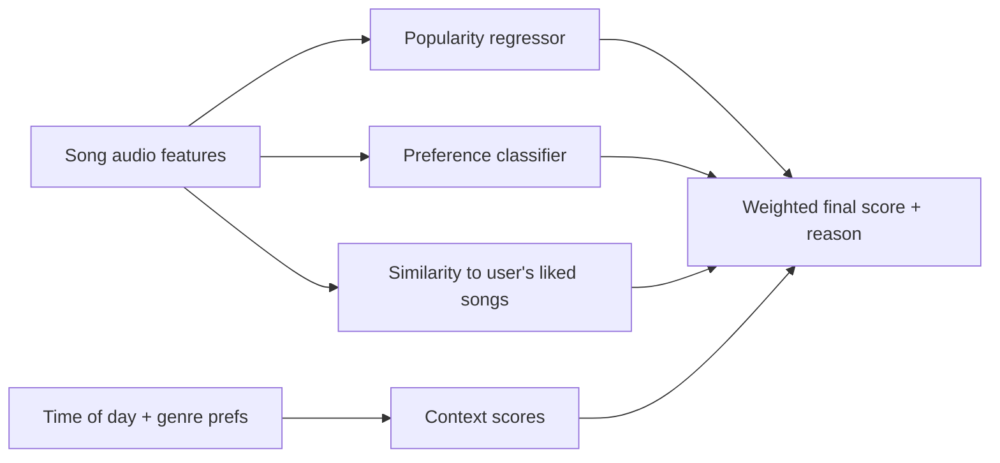

# MoodMix: ML-Powered Music Recommender


A Streamlit app that recommends songs based on a listener's preferred genres, listening history, ratings, and time of day. It combines supervised ML models with content-based similarity and time-of-day context into one explainable recommendation score; the accompanying notebook adds user-user and item-item collaborative filtering.

- **Live demo:** https://moodmix-py.streamlit.app/
- **Companion project (SQL version):** [music-recommendation-app](https://github.com/Shreyashree-Mondal/music-recommendation-app), a 3NF MySQL design of the same domain

Built as a team project (Group 14) for a graduate analytics course at the University of Houston.

## What the app does

- **Sign-in and onboarding:** users pick their favourite genres.
- **Explore and rate songs:** listening history and 1–5 star ratings are recorded.
- **Personalised recommendations:** each song gets a score, with a plain-language reason ("matches your preferred genre", "audio profile suits evening listening", and so on).
- **Analytics dashboard:** interactive Plotly charts for EDA, regression, classification, feature importance, and user behaviour.

## How recommendations are scored



| Signal in the live app | Weight |
|---|---|
| Audio similarity to the user's liked/listened songs (cosine on scaled features) | 0.20 + 0.12 |
| Preference probability from a Logistic Regression classifier | 0.18 |
| Predicted popularity from the best regression model | 0.16 |
| Time-of-day fit (energy, acousticness, tempo, valence) | 0.14 |
| Preferred-genre match | 0.10 + 0.04 |
| Genre the user plays at this time of day | 0.06 |

Songs the user has already heard or rated are excluded, and each recommendation shows the reasons behind its score.

**Notebook vs. live app.** The notebook builds the full version: true user-user and item-item collaborative filtering on the ratings matrix, and a preference classifier trained on users' like/dislike ratings. To stay fast and work for brand-new users, the live app uses a lighter version: the two collaborative-filtering slots are approximated by audio similarity and genre match, and the preference classifier is trained on above-median popularity as a stand-in for "liked". Porting the full collaborative filtering into the app is the main next step.

## Data

- **Songs:** 587 Spotify top-chart songs from 2010–2019 (`top10s.csv`) with audio features: tempo, energy, danceability, loudness, liveness, valence, duration, acousticness, and speechiness. 16 duplicates removed using regex-normalised title/artist keys.
- **Users (notebook analysis):** 51 users, 1,253 listening records, and 819 ratings. Most of this interaction data was **simulated** to bootstrap the recommender: each synthetic user has 2–4 preferred genres, listens mostly within them, and rates songs using genre match, popularity, and random noise.

## Models and results

All models use scikit-learn pipelines (median imputation, scaling where needed) with a fixed seed of 42 and a 70/30 split. Hyperparameters were tuned with GridSearchCV / RandomizedSearchCV and 5-fold cross-validation.

**1. Popularity regression** (Linear, Polynomial, Decision Tree, Random Forest, log-target Random Forest)

| Best model | MAE | RMSE | R² |
|---|---|---|---|
| Random Forest Regressor | 10.10 | 13.42 | 0.07 |

Audio features explain very little of a song's popularity (OLS R² = 0.12). Only release year and loudness (positive) and energy (negative) were statistically significant. Polynomial regression overfit (R² = −0.13).

**2. Like/dislike prediction** (Logistic Regression, Decision Tree, Random Forest, SVM; balanced class weights)

| Best model | Accuracy | Precision | Recall | F1 |
|---|---|---|---|---|
| Decision Tree | 57.7% | 57.3% | 70.9% | 0.634 |

The model was selected on recall, to avoid missing songs a user would like. Because the ratings are simulated from genre and popularity, these scores measure how well audio features recover that simulated preference signal rather than real listener taste.

**3. Genre classification** (Decision Tree, Random Forest, SVM)

| Best model | Accuracy | Weighted F1 |
|---|---|---|
| Random Forest | 60.4% | 0.48 |

This is only slightly above the majority-class baseline: "dance pop" alone is about 60% of the test set, and the models rarely predict the smaller genres correctly. With dozens of fine-grained genres and few examples of each, audio features alone can't separate them.

## Limitations and next steps

- User interactions are mostly simulated, so model scores don't reflect real listener behaviour. Collecting real ratings is the most valuable next step.
- Genre labels are very fine-grained; grouping them into broader families (pop, hip hop, electronic, and so on) would make genre prediction meaningful.
- On Streamlit Community Cloud, new users and ratings are stored in CSV files that reset when the app restarts. A hosted database (as in the SQL version of this project) would make them persistent.
- Recommendation weights were set by hand; they could be tuned against held-out ratings.
- The live app approximates collaborative filtering; bringing the notebook's user-user and item-item CF into the app would make recommendations truly personalised.

## Testing

28 automated pytest tests run on every push through GitHub Actions:

- **Logic tests** (`tests/test_logic.py`): data loading and de-duplication, genre parsing, time-of-day scoring, model training and prediction ranges, user sign-up/login, rating updates, and recommendations (ranked, scored between 0 and 1, explained, logged, and never repeating songs the user already rated).
- **UI tests** (`tests/test_app_ui.py`): the real app runs headlessly with Streamlit's `AppTest`; the tests sign in, choose genres, open every page, and generate recommendations, checking that nothing errors.

Tests run against a temporary copy of the app, so they never modify the data files in the repo.

## Project structure

```
app.py                                   Streamlit app (UI, models, recommender, analytics)
top10s.csv                               Song dataset (user files such as users.csv and ratings.csv are created by the app)
notebooks/music_predictive_analytics.ipynb   EDA, model comparison, and recommender development
tests/                                   pytest suite (logic + UI)
.github/workflows/ci.yml                 runs the tests on every push
requirements.txt
```

## Run locally

```bash
pip install -r requirements.txt
streamlit run app.py

# run the tests
pip install pytest
pytest -v
```

## Tech stack

Python, pandas, NumPy, scikit-learn (Linear/Logistic Regression, Decision Tree, Random Forest, SVM, GridSearchCV), statsmodels (notebook), Plotly, Streamlit, pytest, GitHub Actions, Streamlit Community Cloud.
